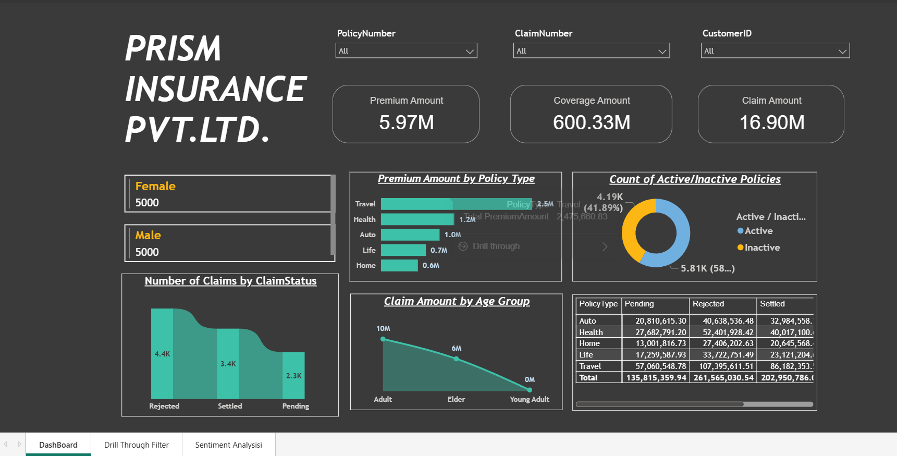
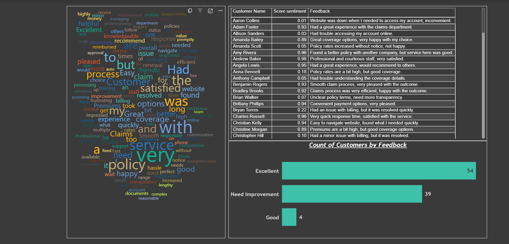

# Insurance Data Analysis 📊

## Overview
This Power BI project provides an interactive and insightful analysis of **insurance data**, helping stakeholders make data-driven decisions. The dashboard covers key metrics such as policy details, claim statuses, premium amounts, and customer feedback sentiment analysis.

## Features
### 1️⃣ Insurance Policy Dashboard
- **Premium Analysis**: Displays total premium collected, average premium per policy, and trend analysis.
- **Claims Overview**: Breakdown of approved, rejected, and pending claims.
- **Coverage Analysis**: Total coverage amount distributed among various policies.
- **Active vs. Inactive Policies**: A visual representation of active policyholders.
- **Claims by Age Group**: Helps identify claim trends across different age demographics.

### 2️⃣ Sentiment Analysis of Customer Feedback
- **Customer Feedback Classification**: Analyzes customer reviews and categorizes them into **positive, neutral, or negative sentiments**.
- **Sentiment Trends**: Identifies how customer sentiment has changed over time.
- **Word Cloud Visualization**: Highlights frequently mentioned words in feedback.
- **Insights for Improvement**: Helps the business enhance customer experience based on feedback trends.

## Tech Stack 🛠️
- **Power BI**: Used for data visualization and dashboard creation.
- **SQL**: For data extraction and transformation.

## Dashboard Preview 📷
### Insurance Policy Dashboard

### Sentiment Analysis of Customer Feedback

## How to Use 🔍
1. Open the **Power BI .pbix file** in Power BI Desktop.
2. Connect to the dataset (SQL, Excel, or CSV sources).
3. Refresh the data to update visualizations.
4. Explore different pages and filters for deeper insights.

## Future Improvements 🚀
- **More advanced predictive analysis** using ML models.
- **Interactive storytelling** for deeper insights.
- **Integration with real-time data sources** for live tracking.

## Author
👨‍💻 **Lokesh Bapte**  
📧 lokesh18.ml@gmail.com
🔗
